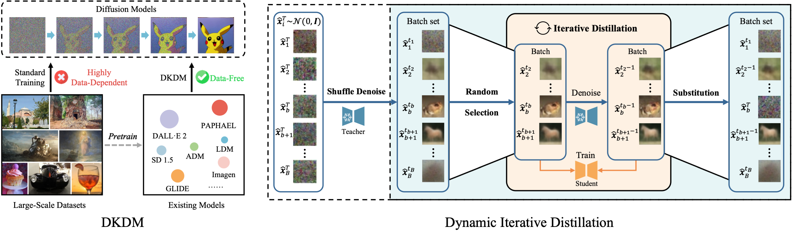

# DKDM

The repository contains the code for our paper "[DKDM: Data-Free Knowledge Distillation for Diffusion Models with Any Architecture](https://arxiv.org/abs/2409.03550)" (CVPR 2025). We have released all the codes for **our method** and **baselines**. If you have any questions, please feel free to raise an issue or contact us via email (<xiangqianlongcs@gmail.com>).

**Summary of our paper**:

- **DKDM**: A scenario, or a question, which asks: *Can we train new diffusion models by using existing pretrained diffusion models as the data source, thereby eliminating the need to access or store any dataset?*
- **Dynamic Iterative Distillation**: Our proposed method to answer the above question.



## News

- **[2025-03-28]** 🚀 We release the code about image generation in latent space. Please refer to [latent-diffusion/README.md](latent-diffusion/README.md) for details.
- **[2025-03-17]** 🚀 We release the code about image generation in pixel space. Please refer to [guided-diffusion/README.md](guided-diffusion/README.md) for details.
- **[2025-02-27]** 🚀 Our paper is accepted by CVPR 2025 paper!

Our future works will focus on:

- [ ] Implementations on diffusers
- [ ] Text-to-image generation
- [ ] More modalities

## Dynamic Iterative Distillation

We implement the dynamic iterative distillation in pixel and latent space, respectively. Please refer to [guided-diffusion/README.md](guided-diffusion/README.md) and [latent-diffusion/README.md](latent-diffusion/README.md) for details.

## Acknowledgement

Our codebase is built upon [guided-diffusion](https://github.com/openai/guided-diffusion) and [latent-diffusion](https://github.com/CompVis/latent-diffusion), which train diffusion models in pixel space and latent space, respectively. Thanks for their great works! We also thank Xingyi Yang, one of the authors of *Diffusion Probabilistic Model Made Slim, CVPR 2023*, for his help in the implementation of distilling latent diffusion models.

If you find our paper and repository helpful, please consider citing our paper:

```bibtex
@article{xiang2024dkdm,
  title={DKDM: Data-Free Knowledge Distillation for Diffusion Models with Any Architecture},
  author={Xiang, Qianlong and Zhang, Miao and Shang, Yuzhang and Wu, Jianlong and Yan, Yan and Nie, Liqiang},
  journal={arXiv preprint arXiv:2409.03550},
  year={2024}
}
```
